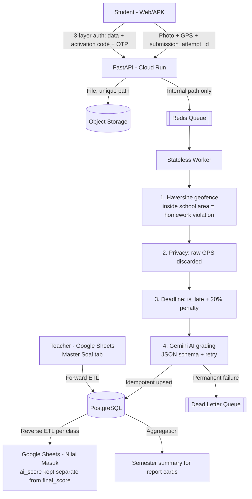

# SPASI — Student Task & Location Tracking Pipeline

A data pipeline for student homework: students upload a photo of their answers, the system validates their location and the submission deadline, an AI model (Gemini) grades the work against the teacher's rubric, and the results are synchronised to Google Sheets, which serves as the teacher's "command center".

Designed for a target of 10,000 students, with an emphasis on data integrity (idempotency, a dead letter queue), privacy (identities are hashed, phone numbers are encrypted, and raw GPS coordinates are never stored), and infrastructure that is fully defined as code.

## Architecture



## Key Design Decisions

| Problem | Decision |
|---|---|
| A student taps "Submit" twice, or the network retries the request | `submission_attempt_id` (a client-generated UUID) serves as the primary key; the worker checks for duplicates before calling the AI |
| Assignment revisions before the deadline | Every revision is stored as a new row (full history preserved), and only one row has `is_latest_submission = TRUE` |
| Queue backlog as the deadline approaches | The worker reads files through a service account rather than via Signed URLs, which can expire |
| Malformed or hallucinated AI responses | JSON schema validation and a `tingkat_keyakinan` (confidence level) threshold, retries with backoff, then quarantine in the DLQ |
| Teachers' manual grades overwritten by a sync | The `ai_score` column (automatic) is kept separate from `final_score` (teacher-owned); the sync never touches `final_score` |
| Google Sheets slowing down with thousands of rows | One spreadsheet per class (`class_spreadsheet_mapping`) plus a compact per-semester summary tab |
| School student IDs (NIS) are only 4 digits long (school policy) | Hash plus a secret pepper; the primary line of defence is the physical activation code, the OTP, and rate limiting |
| Phone numbers must remain usable for sending OTPs | Encrypted (reversible) rather than hashed; siblings may share the same number |
| Browser time zone (UTC) vs. deadline time zone (WIB) | All timestamps are normalised to the school's time zone before comparison |

## Running Locally (Demo Mode)

Prerequisites: Docker Desktop and Python 3.10+.

```bash
docker compose up --build -d     # Postgres, Redis, API, worker, scheduler, frontend
pip install requests
python scripts/demo_local.py     # automated end-to-end scenario
```

Demo mode uses mock AI and WhatsApp services (free, no API keys required; the OTP is displayed on screen). The student frontend is available at http://localhost:3000.

To try the real Gemini, create a `.env` file containing `SPASI_MOCK_AI=0` and `GEMINI_API_KEY=...`, then run `docker compose up -d` again.

To wipe all local data: `docker compose down -v`.

## Testing

```bash
python -m unittest discover -s tests -v                       # unit tests, no external dependencies
SPASI_INTEGRATION=1 python -m unittest discover -s tests/integration -v   # requires Postgres + Redis
```

| Suite | Coverage | Runs on |
|---|---|---|
| `test_geofence.py` | Haversine, 150 m vs. 151 m radius boundary, homework vs. attendance mode | local & CI |
| `test_security.py` | Hash + pepper, phone number encrypt/decrypt round trip, OTP | local & CI |
| `test_worker_pipeline.py` | The actual `worker.py`: geofence, GPS privacy, deadline, time zones, revisions, idempotency, retry + DLQ, report card summary | local & CI |
| `test_import_roster.py` | Roster hashing/encryption, shared phone numbers, re-imports never issue spurious activation codes | local & CI |
| `integration/test_api_e2e.py` | Full flow over HTTP against real Postgres + Redis: 3-layer registration, rate limiting, assignments, submission, worker, reporting | CI (service containers) |

## Deploying to GCP

### One-Time Setup

1. Create a bucket for the Terraform state:
   ```bash
   bash scripts/bootstrap_tf_state.sh <PROJECT_ID> spasi-tfstate-<PROJECT_ID>
   ```
2. The service account for GitHub Actions (supplied as `GCP_SA_KEY`) requires the following roles: Editor, Project IAM Admin, Secret Manager Admin, Cloud Run Admin, Service Account User, and Storage Admin on the state bucket.
3. Add the GitHub Secrets (Settings → Secrets and variables → Actions). The names must match exactly:

| Secret | Required | Value |
|---|---|---|
| `GCP_PROJECT_ID` | yes | GCP project ID |
| `GCP_REGION` | yes | e.g. `asia-southeast2` |
| `GCP_SA_KEY` | yes | Deployment service account JSON key |
| `TF_STATE_BUCKET` | yes | Bucket name from step 1 |
| `DB_PASSWORD` | yes | Database password |
| `GEMINI_API_KEY` | yes | Gemini API key |
| `WHATSAPP_API_KEY` | yes | WhatsApp provider API key |
| `PHONE_ENCRYPTION_KEY` | yes | Long random string |
| `NIS_HASH_PEPPER` | yes | Long random string |
| `JWT_SECRET` | yes | Long random string |
| `GOOGLE_OAUTH_CLIENT_ID` | for teacher login | OAuth Client ID |
| `SPREADSHEET_ID` | for Sheets sync | ID of the Master Soal spreadsheet |

> **Important:** `PHONE_ENCRYPTION_KEY` and `NIS_HASH_PEPPER` must not be changed once a roster has been imported. Changing either one makes phone numbers impossible to decrypt and causes NIS values to stop matching.

### CI/CD Flow

- **Pull request**: unit tests, integration tests (against real Postgres + Redis), `terraform validate`, and `terraform plan`.
- **Merge to `main`**: the Artifact Registry is created first, the image is built and tagged with the commit SHA, the full infrastructure is applied, the worker VM is restarted, and a smoke test then hits `/health`.

### After the First Deployment

1. Run `terraform output app_service_account_email`, then share the teacher's spreadsheet with that email address as an Editor.
2. The spreadsheet needs a `Master Soal` ("Master Questions") tab with the columns: ID Soal (Question ID), Judul (Title), Link GDrive Soal (Question Drive Link), Tenggat Waktu (Deadline), Rubrik Penilaian/Prompt AI (Grading Rubric/AI Prompt), Semester; and a `Nilai Masuk` ("Incoming Grades") tab with the columns: Nama Siswa (Student Name), ai_score, status_lokasi (location status), final_score.
3. Import the student roster into the staging database with `scripts/import_roster.py`, then hand out the printed activation codes to students in person.
4. Open the frontend with `index.html?api=<api_url>`.

## Infrastructure (Terraform)

Cloud Run (API) · Cloud SQL PostgreSQL 15 with daily backups and encrypted connections · Memorystore Redis + Serverless VPC Connector · Cloud Storage with no public access · Secret Manager · Artifact Registry · Compute Engine (worker + scheduler + Cloud SQL Auth Proxy) · remote state in GCS.

## Known Limitations

- Web browsers cannot detect fake GPS. Mock-location detection is only effective in a native Android app that sends `mock_location_detected` from the OS flag; rooted devices can still conceal it.
- The geofence uses a fixed radius; phone GPS accuracy (roughly 5–20 m) can occasionally misclassify submissions made right at the edge of the radius.
- The worker runs on a single VM. This is sufficient for the early stage; at full scale, consider an instance group or a migration to Pub/Sub + Cloud Run.
- Teacher login via Google does not yet restrict sign-ins to the school's email domain (a `TODO` in `api.py`), and CORS is still open to all origins.
- DLQ alerts are currently log-only; they are not yet connected to email or Slack.
- WhatsApp OTP costs grow with the number of students (a deliberate trade-off in favour of account integrity).
