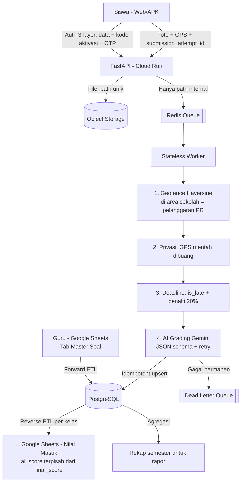

# SPASI — Student Task & Location Tracking Pipeline

Pipeline data untuk tugas rumah (PR) siswa: siswa mengunggah foto jawaban, sistem memvalidasi lokasi dan tenggat waktu, AI (Gemini) menilai berdasarkan rubrik guru, lalu nilai disinkronkan ke Google Sheets yang menjadi "command center" guru.

Dirancang untuk target 10.000 siswa, dengan fokus pada integritas data (idempotency, dead letter queue), privasi (identitas di-hash, nomor HP dienkripsi, koordinat GPS mentah tidak pernah disimpan), dan infrastruktur yang sepenuhnya didefinisikan sebagai kode.

## Arsitektur



## Keputusan desain utama

| Masalah | Keputusan |
|---|---|
| Siswa menekan "Kirim" dua kali / jaringan retry | `submission_attempt_id` (UUID dari klien) sebagai primary key; worker mengecek duplikat sebelum memanggil AI |
| Revisi tugas sebelum deadline | Setiap revisi baris baru (histori utuh), hanya satu yang `is_latest_submission = TRUE` |
| Antrean menumpuk menjelang deadline | Worker membaca file via service account, bukan Signed URL yang bisa kedaluwarsa |
| Respons AI rusak/halusinasi | Validasi skema JSON + batas `tingkat_keyakinan`, retry dengan backoff, lalu karantina ke DLQ |
| Nilai manual guru tertimpa sinkronisasi | Kolom `ai_score` (otomatis) dipisah dari `final_score` (guru); sync tidak pernah menyentuh `final_score` |
| Google Sheets lambat di ribuan baris | Satu spreadsheet per kelas (`class_spreadsheet_mapping`) + tab rekap ringkas per semester |
| NIS sekolah hanya 4 digit (kebijakan sekolah) | Hash + pepper rahasia; pertahanan utama di kode aktivasi fisik + OTP + rate limit |
| Nomor HP harus bisa dipakai kirim OTP | Dienkripsi (reversible), bukan di-hash; boleh sama untuk kakak-adik |
| Zona waktu browser (UTC) vs deadline (WIB) | Semua waktu dinormalkan ke zona waktu sekolah sebelum dibandingkan |

## Menjalankan lokal (mode demo)

Prasyarat: Docker Desktop dan Python 3.10+.

```bash
docker compose up --build -d     # Postgres, Redis, API, worker, scheduler, frontend
pip install requests
python scripts/demo_local.py     # skenario end-to-end otomatis
```

Mode demo memakai AI dan WhatsApp tiruan (gratis, tanpa API key, OTP ditampilkan di layar). Frontend siswa tersedia di http://localhost:3000.

Untuk mencoba Gemini sungguhan, buat file `.env` berisi `SPASI_MOCK_AI=0` dan `GEMINI_API_KEY=...`, lalu `docker compose up -d` lagi.

Reset total data lokal: `docker compose down -v`.

## Testing

```bash
python -m unittest discover -s tests -v                       # unit test, tanpa dependensi luar
SPASI_INTEGRATION=1 python -m unittest discover -s tests/integration -v   # butuh Postgres + Redis
```

| Suite | Isi | Jalan di |
|---|---|---|
| `test_geofence.py` | Haversine, batas radius 150 m vs 151 m, mode PR vs presensi | lokal & CI |
| `test_security.py` | hash + pepper, enkripsi nomor HP bolak-balik, OTP | lokal & CI |
| `test_worker_pipeline.py` | `worker.py` asli: geofence, privasi GPS, deadline, zona waktu, revisi, idempotency, retry + DLQ, rekap rapor | lokal & CI |
| `test_import_roster.py` | hash/enkripsi roster, nomor HP bersama, import ulang tidak menerbitkan kode palsu | lokal & CI |
| `integration/test_api_e2e.py` | Alur penuh lewat HTTP dengan Postgres + Redis asli: daftar 3-layer, rate limit, tugas, submit, worker, laporan | CI (service container) |

## Deploy ke GCP

### Persiapan sekali saja

1. Buat bucket untuk Terraform state:
   ```bash
   bash scripts/bootstrap_tf_state.sh <PROJECT_ID> spasi-tfstate-<PROJECT_ID>
   ```
2. Service account untuk GitHub Actions (isi `GCP_SA_KEY`) membutuhkan peran: Editor, Project IAM Admin, Secret Manager Admin, Cloud Run Admin, Service Account User, dan Storage Admin pada bucket state.
3. Isi GitHub Secrets (Settings → Secrets and variables → Actions). Nama harus persis sama:

| Secret | Wajib | Isi |
|---|---|---|
| `GCP_PROJECT_ID` | ya | ID project GCP |
| `GCP_REGION` | ya | mis. `asia-southeast2` |
| `GCP_SA_KEY` | ya | JSON key service account deploy |
| `TF_STATE_BUCKET` | ya | nama bucket dari langkah 1 |
| `DB_PASSWORD` | ya | password database |
| `GEMINI_API_KEY` | ya | API key Gemini |
| `WHATSAPP_API_KEY` | ya | API key provider WhatsApp |
| `PHONE_ENCRYPTION_KEY` | ya | string acak panjang |
| `NIS_HASH_PEPPER` | ya | string acak panjang |
| `JWT_SECRET` | ya | string acak panjang |
| `GOOGLE_OAUTH_CLIENT_ID` | untuk login guru | OAuth Client ID |
| `SPREADSHEET_ID` | untuk sync Sheets | ID spreadsheet Master Soal |

> Penting: `PHONE_ENCRYPTION_KEY` dan `NIS_HASH_PEPPER` tidak boleh diganti setelah roster diimport. Mengganti keduanya membuat nomor HP tidak bisa didekripsi dan NIS tidak cocok lagi.

### Alur CI/CD

- **Pull request**: unit test, test integrasi (Postgres + Redis asli), `terraform validate`, dan `terraform plan`.
- **Merge ke `main`**: Artifact Registry dibuat dulu, image di-build dengan tag commit SHA, seluruh infra di-apply, worker VM di-restart, lalu smoke test ke `/health`.

### Setelah deploy pertama

1. Jalankan `terraform output app_service_account_email`, lalu share spreadsheet guru ke email itu sebagai Editor.
2. Spreadsheet membutuhkan tab `Master Soal` (kolom: ID Soal, Judul, Link GDrive Soal, Tenggat Waktu, Rubrik Penilaian/Prompt AI, Semester) dan tab `Nilai Masuk` (kolom: Nama Siswa, ai_score, status_lokasi, final_score).
3. Import roster siswa ke database staging dengan `scripts/import_roster.py`, lalu bagikan kode aktivasi yang dicetak ke siswa secara fisik.
4. Buka frontend dengan `index.html?api=<api_url>`.

## Infrastruktur (Terraform)

Cloud Run (API) · Cloud SQL PostgreSQL 15 dengan backup harian dan koneksi terenkripsi · Memorystore Redis + Serverless VPC Connector · Cloud Storage tanpa akses publik · Secret Manager · Artifact Registry · Compute Engine (worker + scheduler + Cloud SQL Auth Proxy) · remote state di GCS.

## Keterbatasan yang diketahui

- Browser web tidak bisa mendeteksi fake GPS. Deteksi mock location hanya efektif di aplikasi Android native yang mengirim `mock_location_detected` dari flag OS; perangkat yang di-root tetap bisa menyembunyikannya.
- Geofence memakai radius tetap; akurasi GPS ponsel (sekitar 5–20 m) bisa membuat pengiriman tepat di tepi radius salah klasifikasi sesekali.
- Worker berjalan di satu VM. Cukup untuk tahap awal; untuk skala penuh, pertimbangkan instance group atau migrasi ke Pub/Sub + Cloud Run.
- Login guru via Google belum membatasi domain email sekolah (`TODO` di `api.py`), dan CORS masih terbuka untuk semua origin.
- Alert DLQ baru berupa log; belum terhubung ke email/Slack.
- Biaya OTP WhatsApp naik seiring jumlah siswa (trade-off yang disengaja demi integritas akun).
